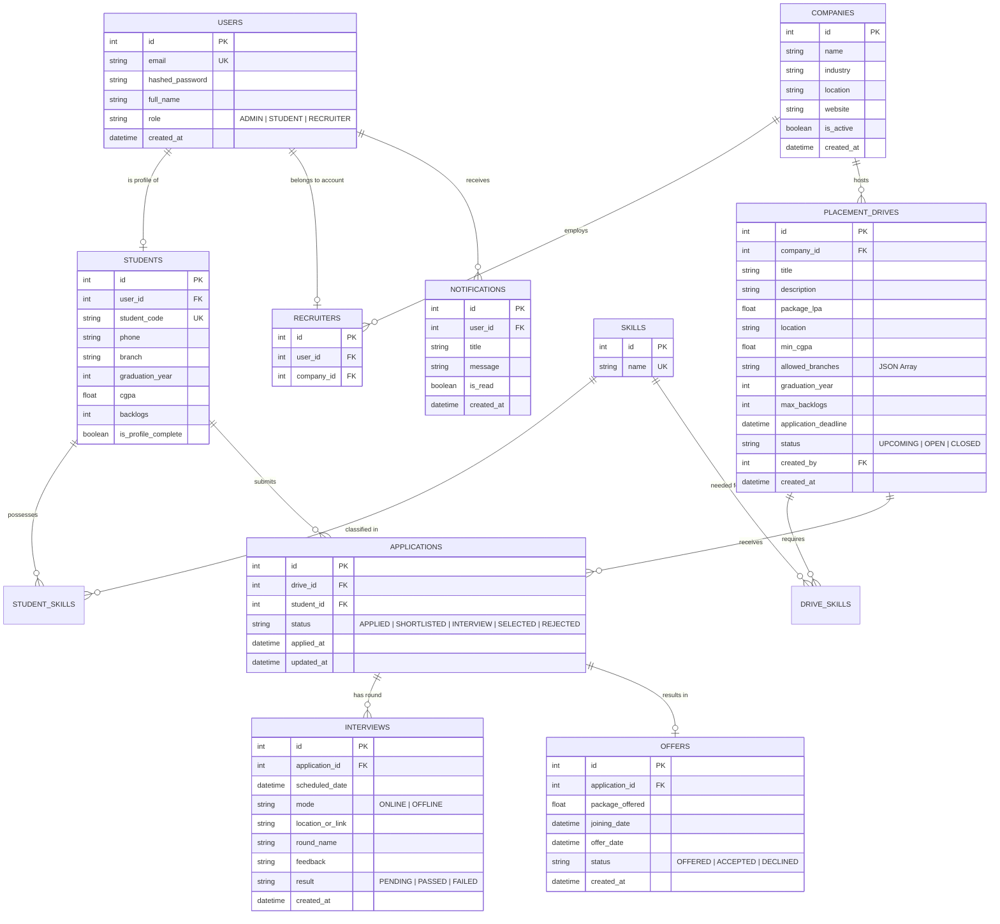

# Database Design & ER Diagram

## 1. Relational Entity Explanation

| Entity Table | Primary Key | Key Foreign Keys | Purpose & Business Context |
| :--- | :--- | :--- | :--- |
| **`users`** | `id` | None | Base identity store for authentication (Admin, Student, Recruiter). |
| **`students`** | `id` | `user_id` -> `users.id` | Academic and personal profile store for student role. |
| **`skills`** | `id` | None | Normalized dictionary of technical skills (e.g., Python, SQL, React). |
| **`student_skills`** | `(student_id, skill_id)` | FKs to `students`, `skills` | Many-to-many join table for student skill sets. |
| **`companies`** | `id` | None | Onboarded corporate hiring partners. |
| **`recruiters`** | `id` | `user_id` -> `users`, `company_id` -> `companies` | Links recruiter user accounts to their respective company profile. |
| **`placement_drives`** | `id` | `company_id` -> `companies`, `created_by` -> `users` | Hiring job postings containing eligibility criteria & deadlines. |
| **`drive_skills`** | `(drive_id, skill_id)` | FKs to `placement_drives`, `skills` | Mandatory skill requirements for placement drives. |
| **`applications`** | `id` | `drive_id` -> `placement_drives`, `student_id` -> `students` | Core candidate job application lifecycle tracking entity. |
| **`interviews`** | `id` | `application_id` -> `applications.id` | Schedules, meeting details, and outcome records for interviews. |
| **`offers`** | `id` | `application_id` -> `applications.id` | Official employment offers generated for selected candidates. |
| **`notifications`** | `id` | `user_id` -> `users.id` | In-app user notifications for status updates and reminders. |

---

## 2. Entity-Relationship (ER) Diagram (Mermaid)

